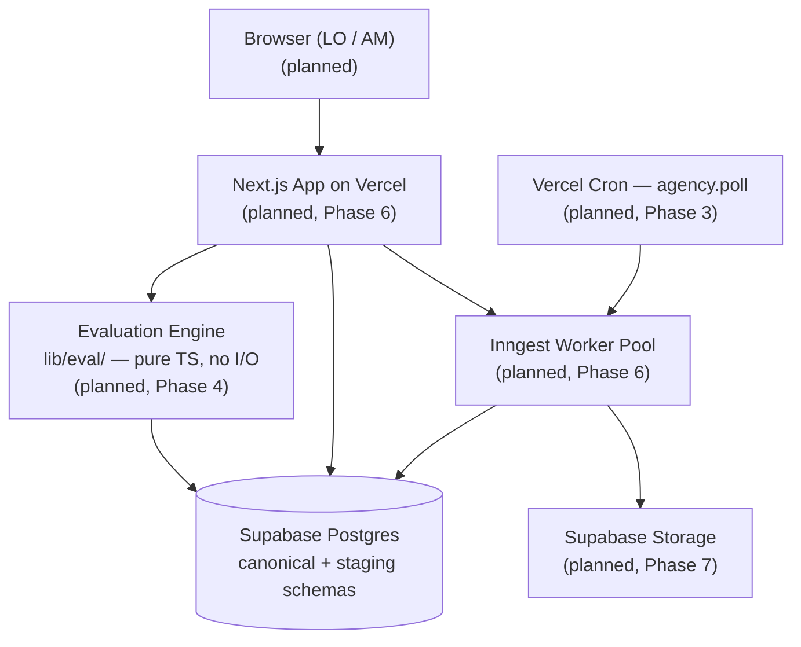

<!-- generated-by: gsd-doc-writer -->
# Architecture

> **Status:** Phases 1 (Tenant Isolation Foundation) and 2 (Rule Schema) have shipped. The
> rest of this document describes the planned architecture from `.planning/research/ARCHITECTURE.md`
> and `.planning/PROJECT.md`. Sections marked **Shipped** describe code that exists today;
> sections marked **Planned** describe components that will land in later phases.
>
> The legacy React prototype at `src/App.js` is **not** the current architecture and is not
> documented here. It exists in the tree only as a throwaway reference and is excluded from
> ESLint, TypeScript, and the active build path. Phase 6 deletes it.

## System Overview

Lender Search is a Postgres-centric Next.js monolith with strict separation between the
synchronous evaluation hot path (LO scenario search → ranked eligibility result) and the
asynchronous extraction pipeline (AM PDF upload → multi-pass extraction → human review →
canonical commit). Tenant isolation is enforced at the database via `FORCE ROW LEVEL SECURITY`,
not at the application layer. The system is built around four architectural commitments that
hold from day one:

1. **Database-enforced tenancy.** Every tenant-scoped table has `tenant_id uuid NOT NULL`, an
   indexed RLS policy keyed on `current_setting('app.tenant_id', true)::uuid`, and
   `FORCE ROW LEVEL SECURITY` so even the table owner cannot bypass policy.
2. **Citation discipline as a schema constraint.** A `program_rule` row cannot persist without
   a `rule_citation` FK pointing at a source document. This is enforced by `NOT NULL` on
   `program_rule.primary_citation_id` — not by application validation.
3. **Bitemporal versioning.** `program_version` and `agency_rule_version` carry
   `effective_period daterange` plus `EXCLUDE USING gist` constraints preventing overlapping
   active versions for the same program / agency.
4. **Layered rule model.** `agency_rule` (system-owned, `AGENCY_BASE` layer) → `program_rule`
   (tenant-scoped, `INVESTOR_OVERLAY` | `PRODUCT_FEATURE` layer) → `lender_overlay_rule`
   (tenant-scoped, `LENDER_OVERLAY` layer). Programs reference an agency version by FK; rules
   are never embedded.

## Component Diagram

The following diagram shows the canonical (target) shape. Components labeled **(planned)**
are not yet implemented; the current codebase ships only the database tier and the tenant
context primitive.



The shipped tier is the database itself: schema, RLS policies, the citation/loosening
constraints, the rule-kind dispatch table, and the pen-test harness that exercises them.

## Component Responsibilities

| Component | Status | Owns | Implementation |
|-----------|--------|------|----------------|
| **Postgres schema (canonical)** | Shipped | Tenant rows, agency-rule versioning, program versioning, layered rules, citations | `db/schema/*.ts` (Drizzle 0.45) + `db/migrations/000{0..6}_*.sql` (drizzle-kit + `--custom`) |
| **Tenant isolation (RLS)** | Shipped | Database-enforced filtering on every tenant-scoped table | `pgPolicy(...)` declarations in each `db/schema/*.ts` + `db/migrations/0001_force_rls.sql`, `0003_force_rls_program.sql`, `0005_force_rls_agency.sql` |
| **`setTenantContext` primitive** | Shipped | Setting `app.tenant_id` GUC per transaction so RLS policies see the caller's tenant | `lib/tenant/context.ts` |
| **Drizzle client** | Shipped | Typed query layer over `postgres-js` driver with `prepare: false` (Supabase pooler posture) | `lib/db/client.ts` |
| **Env validation** | Shipped | Boot-time env contract; throws synchronously on missing/malformed required vars | `lib/env.ts` (`@t3-oss/env-core` + Zod) |
| **Rule-kind Zod schemas** | Shipped | Per-rule-kind validation of the `rule_body jsonb` shape (17 kinds) | `lib/rules/schemas/*.ts` + `lib/rules/schemas/index.ts` (`parseRuleBody` dispatch) |
| **`detect_loosenings(uuid)` SQL function** | Shipped | Detects when an `INVESTOR_OVERLAY` rule loosens its corresponding `AGENCY_BASE` rule (data-quality surface for AM review) | `db/migrations/0006_detect_loosenings.sql` |
| **RLS pen-test harness** | Shipped | CI gate: cross-tenant SELECT/INSERT/UPDATE/DELETE attempts must return zero rows or be rejected | `tests/rls/*.test.ts`, `tests/rls/setup.ts`, `tests/rls/global-setup.ts`, `tests/rls/seedTwoTenants.ts` |
| **Schema structural tests** | Shipped | Asserts FORCE RLS, EXCLUDE constraints, GENERATED columns, CHECKs, dispatch-table coverage | `tests/schema/*.test.ts`, `tests/rules/*.test.ts` |
| **Web frontend (Next.js)** | Planned (Phase 6+) | LO search/results/comparison, AM three-pane review UI | Next.js 16.2 App Router, React 19.2, shadcn/ui, react-pdf for the PDF viewer |
| **API (Server Actions / Route Handlers)** | Planned (Phase 6+) | Scenario submission, AM CRUD on draft rules, Encompass/LendingPad export | Next.js Server Actions inside `withTenantContext` |
| **Evaluation engine** | Planned (Phase 4) | Deterministic eligibility evaluation, rule-stack assembly, near-miss delta calculation | Pure TS module under `lib/eval/`; no I/O; takes `(scenario, snapshot)` and returns `{decision, rule_stack, deciding_rule, near_miss}` |
| **Audit log (`evaluation_event`)** | Planned (Phase 3) | Append-only record of every evaluation, partitioned by month, `REVOKE UPDATE, DELETE` from app role | Postgres table with `PARTITION BY RANGE (evaluated_at)` |
| **Extraction pipeline** | Planned (Phase 7) | OCR → structural parse → LLM normalization → overlay diff → confidence scoring; writes only to `staging.*` | Inngest 4.2 worker pool; Reducto (primary) + Claude Sonnet 4.6 (backup) |
| **AM review surface** | Planned (Phase 8) | Three-pane review UI; confidence-sorted queue; commit transaction promotes `staging.draft_rule` → `program_rule` | Server actions, `react-pdf` + bbox overlay |
| **Agency cascade** | Planned (Phase 3) | Daily Vercel Cron polls FNMA/FHLMC/FHA/VA; new `agency_rule_version` triggers per-affected-program review queue | Vercel Cron + Postgres trigger on `agency_rule_version` insert |

## Data Flow

### Flow 1: LO Scenario → Ranked Result (Synchronous, Hot Path) — Planned (Phase 4 + 6 + 9)

The hot path is fully designed but not yet implemented. The intended sequence:

1. Browser POSTs the scenario payload to a Next.js Server Action.
2. Server Action runs inside `withTenantContext(tenantId, ...)`, which opens a Drizzle
   transaction and calls `setTenantContext` (currently shipped at `lib/tenant/context.ts`)
   to set `app.tenant_id` for the connection.
3. The action hydrates a `RuleSnapshot` — a single SQL query joining `program_version`,
   `program_rule`, `agency_rule_version`, `agency_rule`, and `lender_overlay_rule` filtered
   by `effective_period @> CURRENT_DATE`. Cached per-tenant for ~30s.
4. The pure-TS evaluator runs `evaluate(scenario, program, snapshot)` for each program in
   the snapshot, returning `{decision, rule_stack, deciding_rule, near_miss}`. No I/O.
5. Results are ranked (`eligible` > `near_miss` > `ineligible`) and an
   `evaluation_event` row is written for each (append-only audit).
6. Response returns to the browser.

**Latency budget:** P50 ≤ 2s, P95 ≤ 5s end-to-end (PRD KPI). Snapshot hydration ≤ 200ms,
in-memory evaluation ≤ 100ms for 50 programs.

### Flow 2: AM Upload → Extraction → Review → Commit (Asynchronous) — Planned (Phase 7 + 8)

1. AM uploads a matrix PDF; the Next.js Server Action streams it to Supabase Storage at
   `/tenants/{tenant_id}/programs/{program_id}/{matrix_pdf_sha256}.pdf`.
2. An `INSERT staging.extraction_run (status='queued')` row is created and an Inngest job
   is enqueued.
3. The Inngest worker runs the multi-step pipeline: OCR (Reducto, with bbox citations),
   structural parse, LLM normalization (Claude Sonnet 4.6 with structured outputs), overlay
   diff against the prior `program_version`, per-field confidence scoring. Each step writes
   intermediate results to `staging.draft_rule`.
4. The AM three-pane review UI reads the confidence-sorted queue (`ORDER BY min_confidence ASC`).
5. AM commit is a single transaction that copies accepted `staging.draft_rule` rows into
   `program_rule`, inserts `rule_citation` rows, transitions the prior `program_version` to
   `state='deprecated'`, and inserts the new `program_version` with `state='active'`.

The pipeline never writes to canonical tables outside the AM commit transaction. Re-running
extraction against the same PDF is idempotent.

### Flow 3: Agency Cascade — Planned (Phase 3)

A daily Vercel Cron job (`agency.poll`) fetches the FNMA Selling Guide, FHLMC Bulletins,
FHA Mortgagee Letters, and VA Circulars; hashes the latest documents and compares against
known versions. On a new version, an `agency_rule_version` row is inserted; a Postgres
`AFTER INSERT` trigger enqueues a `cascade.review` job that selects every `program_version`
referencing the now-superseded `agency_rule_version_id` (resolvable via the
`superseded_by` self-FK). The AM team gets a per-affected-program review queue entry.

This is the central differentiator the PRD calls out and is unbuildable on an embedded-rule
model.

## Key Abstractions

The most important interfaces and patterns in the shipped code:

- **`setTenantContext(tx, tenantId)`** — `lib/tenant/context.ts`. The single primitive for
  setting the `app.tenant_id` GUC inside a transaction (`is_local=true` so it dies on
  COMMIT/ROLLBACK and never leaks across pooled connections). The literal string
  `'app.tenant_id'` appears in exactly three places: this file, the `pgPolicy(...)`
  declarations in `db/schema/*.ts`, and the pen-test files in `tests/rls/`. Any other
  reference is a smell. Phase 6 wraps this in a `withTenantContext({ tenantId, fn })`
  request middleware.
- **`env`** — `lib/env.ts`. Boot-time-validated environment via `@t3-oss/env-core` + Zod.
  Required: `DATABASE_URL` (Postgres connection string). Optional Phase 1:
  `SUPABASE_SERVICE_ROLE_KEY`, `RLS_TEST_JWT_SECRET`. Application code reads `env.X`, never
  `process.env.X` — enforced by ESLint `no-restricted-properties` on `app/**`, `pages/**`,
  `src/**`.
- **`db` and `sql`** — `lib/db/client.ts`. Drizzle 0.45 instance over `postgres-js` with
  `prepare: false` (the Supabase Supavisor pooler does not support prepared statements).
  Phase 6 raises `max` connections and sets `ssl: 'require'`.
- **`parseRuleBody(kind, body)`** — `lib/rules/schemas/index.ts`. Type-narrowed Zod
  validation of `rule_body jsonb` per `rule_kind`. Used by the planned Phase 4 evaluator
  (read-path), Phase 7 extraction validator (write-path), and Phase 8 AM commit. Adding a
  new `rule_kind` is a compile-error in `ruleBodySchemas satisfies Record<RuleKind, z.ZodType>`
  until a matching schema is wired.
- **`derogSeasoningSchema`** — `lib/rules/schemas/derog-seasoning.ts`. Structured derogatory-
  event model encoding event type, measurement anchor (DISCHARGE/DISMISSAL/COMPLETION/etc.),
  baseline + extenuating-circumstances waiting months, post-event LTV cap windows with
  purpose/occupancy allow-lists, re-establishment-credit flag, and the
  `mortgage_included_in_bk_rule` enum. This is the schema-level encoding of the FNMA
  derogatory-event matrix that no incumbent has shipped.
- **`detect_loosenings(p_program_version_id uuid)`** — `db/migrations/0006_detect_loosenings.sql`.
  SQL function returning rows where an `INVESTOR_OVERLAY` rule loosens its corresponding
  `AGENCY_BASE` rule. `STABLE`, `SECURITY INVOKER`, so RLS policies on `program_rule` still
  apply. Phase 8 AM commit transaction calls this pre-commit and blocks commit if results
  are non-empty.
- **`daterange` custom type** — `db/schema/_types/daterange.ts`. Drizzle 0.45 has no native
  `daterange`; this `customType` wraps the `[start,end)` half-open Postgres literal form.
  Adjacent ranges `[A,B)` and `[B,C)` do not overlap, so back-to-back versions don't trip
  the EXCLUDE constraint.
- **`tenantKind` enum** — `db/schema/tenant.ts`. Locked four-value enum from day one:
  `BROKERAGE | RETAIL_LENDER | WHOLESALE_LENDER | SYSTEM`. The GTM persona is deferred to
  research, but the schema accommodates the eventual choice without rework.

## Directory Structure

```
lender-search/
├── app/                       # (empty; Phase 6 lands the Next.js App Router)
├── db/
│   ├── schema/                # Drizzle schema-as-code (TS); RLS policies declared inline
│   │   ├── _types/            # Drizzle customType wrappers (daterange)
│   │   ├── tenant.ts          # tenant table + tenant_kind enum + self-filtering policy
│   │   ├── canary.ts          # _rls_canary smoke table (permanent regression target)
│   │   ├── agency-rule-version.ts   # system-owned, world-read + system_role write
│   │   ├── agency-rule.ts           # system-owned, world-read + system_role write
│   │   ├── program.ts               # tenant-scoped parent for indexed lender programs
│   │   ├── program-version.ts       # bitemporal versioned program record
│   │   ├── program-rule.ts          # rule_kind enum (17 values) + program_rule_layer enum
│   │   ├── rule-citation.ts         # citation discipline as schema constraint
│   │   ├── lender-overlay-rule.ts   # tenant-scoped LENDER_OVERLAY (Phase 12 v2 wires UI)
│   │   ├── system-role.ts           # pgRole().existing() — provisioned by init-db.sh
│   │   └── index.ts           # barrel for drizzle.config.ts
│   └── migrations/            # SQL migrations + drizzle-kit metadata
│       ├── 0000_initial.sql         # tenant + _rls_canary baseline + RLS enable + policies
│       ├── 0001_force_rls.sql       # FORCE RLS on tenant + _rls_canary (--custom)
│       ├── 0002_program_schema.sql  # program/program_version/program_rule/rule_citation/agency_*
│       ├── 0003_force_rls_program.sql  # FORCE RLS on the 5 tenant-scoped Phase 2 tables
│       ├── 0004_program_constraints.sql  # btree_gist + EXCLUDE + jsonb_min_numeric + GENERATED
│       ├── 0005_force_rls_agency.sql   # GRANTs + agency-table policy enablement
│       ├── 0006_detect_loosenings.sql  # SQL function for AM data-quality detection
│       └── meta/              # drizzle-kit snapshots + journal
├── lib/
│   ├── db/
│   │   └── client.ts          # Drizzle instance + raw postgres-js sql tagged template
│   ├── rules/
│   │   └── schemas/           # 17 Zod schemas + dispatch table (parseRuleBody)
│   ├── tenant/
│   │   └── context.ts         # setTenantContext primitive + TENANT_GUC_NAME constant
│   └── env.ts                 # t3-env runtime validation
├── tests/
│   ├── _shared/               # Cross-suite fixtures (agency-fixture.ts)
│   ├── rls/                   # Pen-test suite — non-negotiable CI gate
│   │   ├── setup.ts                 # Asserts NOBYPASSRLS + FORCE RLS in beforeAll
│   │   ├── global-setup.ts          # Per-suite TRUNCATE + GRANT cycle
│   │   ├── seedTwoTenants.ts        # Bootstraps two-tenant fixture
│   │   ├── fixtures/                # connection.ts (pg client) + jwt.ts (jose-signed)
│   │   ├── cross-tenant-select.test.ts
│   │   ├── cross-tenant-write.test.ts
│   │   ├── jwt-tampering.test.ts
│   │   ├── service-role-boundary.test.ts
│   │   ├── guc-reset.test.ts
│   │   ├── index-scan.test.ts
│   │   ├── env-boot.test.ts
│   │   ├── program-cross-tenant.test.ts
│   │   ├── program-version-cross-tenant.test.ts
│   │   ├── program-rule-cross-tenant.test.ts
│   │   ├── rule-citation-cross-tenant.test.ts
│   │   └── lender-overlay-cross-tenant.test.ts
│   ├── rules/                 # Zod schema unit tests + dispatch-table exhaustiveness
│   └── schema/                # DB structural tests (FORCE, EXCLUDE, CHECK, GENERATED, FK)
├── scripts/
│   └── init-db.sh             # Provisions app_user (NOBYPASSRLS NOSUPERUSER) + system_role
├── docker-compose.yml         # Postgres 16-alpine for local dev
├── drizzle.config.ts          # drizzle-kit config — uses DATABASE_MIGRATION_URL when set
├── eslint.config.mjs          # Flat config: blocks process.env + service-role* in app paths
├── vitest.config.ts           # RLS pen-test runner config
├── vitest.schema.config.ts    # Schema structural test runner config
├── vitest.env-boot.config.ts  # Env-boot smoke test config
├── tsconfig.json              # Strict TS 5.7; legacy src/ excluded from include set
├── package.json               # pnpm 9.15.0; Node ≥20.9.0
└── src/                       # Legacy CRA prototype — DO NOT extend; Phase 6 deletes
```

### Directory Structure Rationale

- **`db/` separates schema from migrations.** `db/schema/*.ts` is the developer-facing
  source of truth (typed, code-reviewable Drizzle declarations). `db/migrations/*.sql` is
  the canonical history applied to production. Drizzle-kit generates from schema; `--custom`
  migrations land DDL the schema API does not model (`FORCE ROW LEVEL SECURITY`,
  `EXCLUDE USING gist`, `GENERATED ALWAYS AS STORED` referencing IMMUTABLE functions,
  `CREATE EXTENSION btree_gist`, `CREATE FUNCTION`).
- **`lib/` is dependency-free where it counts.** `lib/rules/schemas/` is pure Zod (no DB
  imports); the planned `lib/eval/` will be pure TS with no I/O. This is the most important
  architectural boundary in the codebase: the evaluator must be lift-and-shiftable into a
  separate service for Phase 2 latency, with no business-logic rewrite.
- **`lib/tenant/` is exactly one file by design.** `setTenantContext` is the only place the
  GUC name `'app.tenant_id'` is referenced from TypeScript. Centralizing it makes "where
  does tenant context come from?" auditable in one read.
- **`tests/rls/` is the antitrust insurance policy.** Every PR runs the full pen-test
  matrix; cross-tenant query attempts must return zero rows or be rejected. CI fails the
  build on any non-zero result. Per `.planning/research/PITFALLS.md` § 3.1, this design is
  the response to the October 2025 *Smith et al. v. Optimal Blue, LLC et al.* class action.
- **`scripts/init-db.sh` provisions roles, not data.** The `app_user` role is
  `NOBYPASSRLS NOSUPERUSER` — superusers implicitly bypass RLS. Pen tests connect as this
  user; the setup file aborts the suite if it detects a privileged connection.
- **`src/` is legacy.** The 1,775-line React 19 CRA prototype lives there only as a
  reference for the LO scenario form shape and the matching-result structure. It is
  ignored by ESLint, excluded from `tsconfig.json`'s `include` set, and slated for deletion
  in Phase 6.

## Architectural Anti-Patterns (Avoided by Design)

These are documented in `.planning/research/ARCHITECTURE.md` § Anti-Patterns and
`.planning/research/PITFALLS.md`. The shipped code is structured to make each one
structurally impossible:

- **Embedding agency rules per program** — programs reference `agency_rule_version_id` by
  FK; the cascade differentiator depends on this. Embedding would make the cascade
  unbuildable.
- **Application-layer tenant filtering** — RLS + `FORCE ROW LEVEL SECURITY` enforced at
  the DB; ESLint blocks `process.env` reads from app paths so configuration can't
  accidentally route around `lib/env.ts`.
- **Mutable audit log** — `evaluation_event` (Phase 3) will have `REVOKE UPDATE, DELETE`
  on the application role; tampering is structurally impossible.
- **Extraction pipeline writing canonical tables** — staging schema (Phase 7) is the only
  sink for the pipeline; AM commit (Phase 8) is the explicit transaction that promotes to
  canonical.
- **Synchronous extraction in the request path** — Phase 7 onward, the AM upload returns
  202 Accepted immediately and Inngest workers run the pipeline durably (survives Vercel's
  60s function ceiling).
- **Storing the Anthropic API key in localStorage** — the legacy prototype's pattern is
  excluded by design; all LLM calls run server-side via Server Actions, with keys behind
  `lib/env.ts` validation.
- **Cross-tenant data exposure** — release-blocker per `PROJECT.md` § Out of Scope; no
  admin "view as another tenant," no cross-tenant analytics, no aggregated competitive-
  analytics surface.

## Build Order

The full phase sequence is in `.planning/ROADMAP.md`. Phase boundaries are KPI-gated, not
calendar-gated. The architectural critical path:

1. **Phase 1 (shipped):** Tenant Isolation Foundation — RLS + pen-test harness.
2. **Phase 2 (shipped):** Rule Schema — layered model + bitemporal + citation discipline.
3. **Phase 3 (next):** Audit Log + Agency Rule Encoding — append-only `evaluation_event`,
   hand-authored FNMA/FHLMC/FHA/VA seed, agency cascade trigger.
4. **Phase 4:** Pure-TS Evaluation Engine — `lib/eval/` with snapshot hydration, derog
   state machine, near-miss, layer attribution. `json-rules-engine@7.3` vs.
   ~500-LOC custom evaluator decided in this phase's spike on lower-rule-corruption-blast-
   radius criterion.
5. **Phase 5:** Golden Set + Phase 0 Exit Gates — 200-scenario expert-validated golden
   set; Reducto acceptance test (≥95% cell accuracy on 10 representative non-QM matrices);
   precision ≥98%, recall ≥95% gates pass before any UI work begins.
6. **Phase 6:** App Skeleton + Auth + Observability — Next.js 16.2 + Supabase Auth + JWT
   tenant context + Inngest worker pool + Sentry/Axiom telemetry.
7. **Phases 7-11:** MVP — extraction pipeline, AM review, LO scenario flow, saved
   scenarios, coverage build-out, brand rename, GTM exit gates.
8. **Phases 12-15:** Coverage expansion, live pricing, workflow intelligence, native
   mobile (conditional), E&O warranty (conditional).

## See Also

- `.planning/PROJECT.md` — full requirements, constraints, key decisions, out-of-scope
- `.planning/ROADMAP.md` — phase-by-phase plan with KPI gates
- `.planning/research/ARCHITECTURE.md` — detailed architecture research with schema
  sketches, data flow diagrams, and anti-pattern rationale
- `.planning/research/STACK.md` — stack research with version pins and rationale
- `.planning/research/PITFALLS.md` — known failure modes and mitigations
- `README.md` — quick-start, PR gate commands, Phase 1 summary
- `CLAUDE.md` — agent guardrails and project conventions
